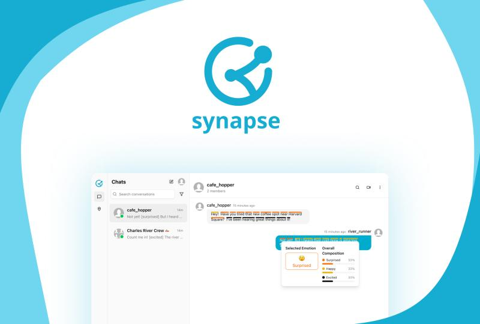
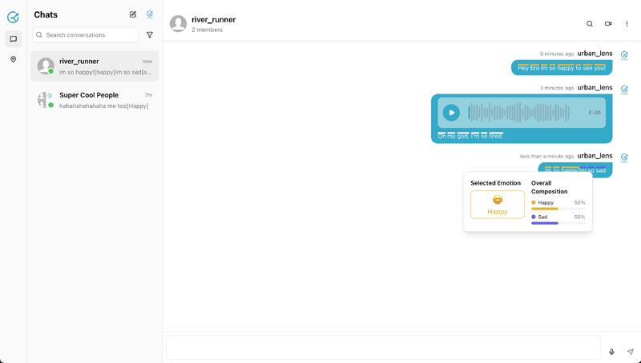
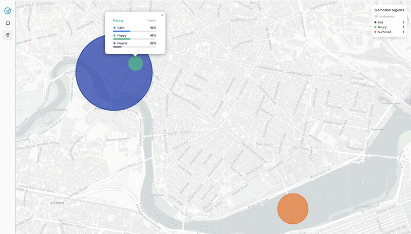

[Devpost link](https://devpost.com/software/synapse-n7hwr3)
[Youtube demo](https://www.youtube.com/watch?v=nuEoH_5YOi4)

Synapse decodes tone, emotion, and intent so online conversations feel human again.
It unifies text, voice, and facial cues into one emotional language, making messages clearer and more empathetic.

Synapse is built for:
- Teams who want emotion-aware communication
- Communities that value clarity and trust
- Builders exploring multimodal AI interactions

## How it works

1. Send a text, voice note, or video-enabled message.
2. Synapse infers emotion from tone, expression, and context.
3. Recipients see the message with emotional annotations and color cues.
4. Optionally generate expressive audio with the intended emotion.

## Highlights

- Multimodal emotion detection across text, audio, and facial cues
- Emotion-aware voice generation with instant cloning
- Dynamic color-based emotion visualization
- Community heatmap for shared sentiment

## Recognition

Synapse won HackHarvard China for its emotion-aware communication experience.

## UI previews

<table>
  <tr>
    <td align="center">
      
       
      Emotion-aware chat with annotated intent.
    </td>
    <td align="center">
      
       
      Community sentiment visualized as a heatmap.
    </td>
  </tr>
</table>
